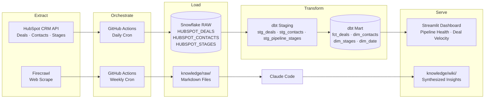
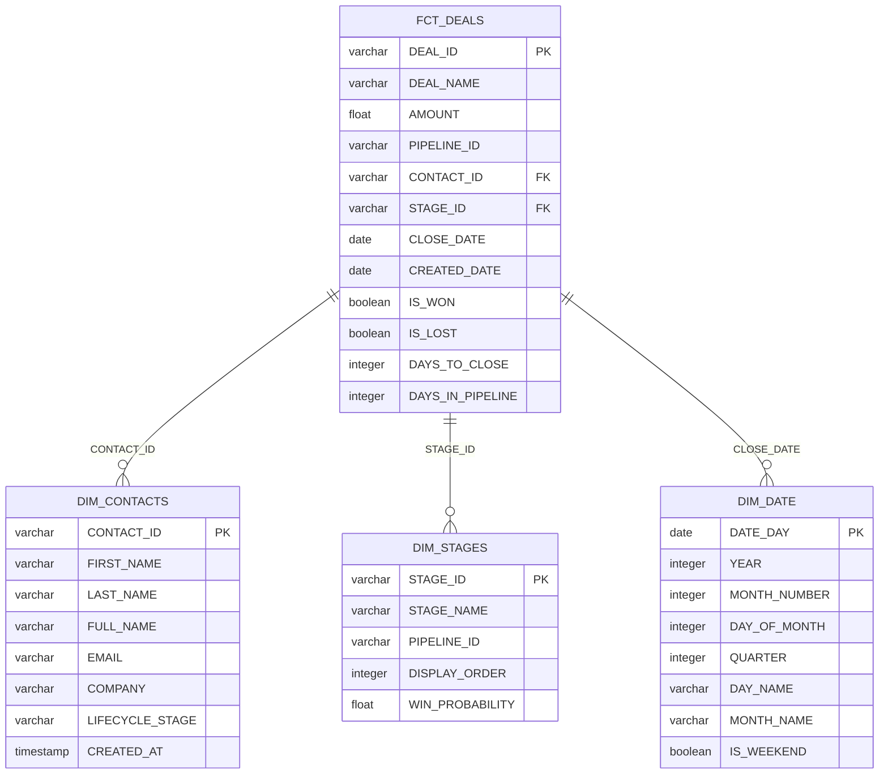
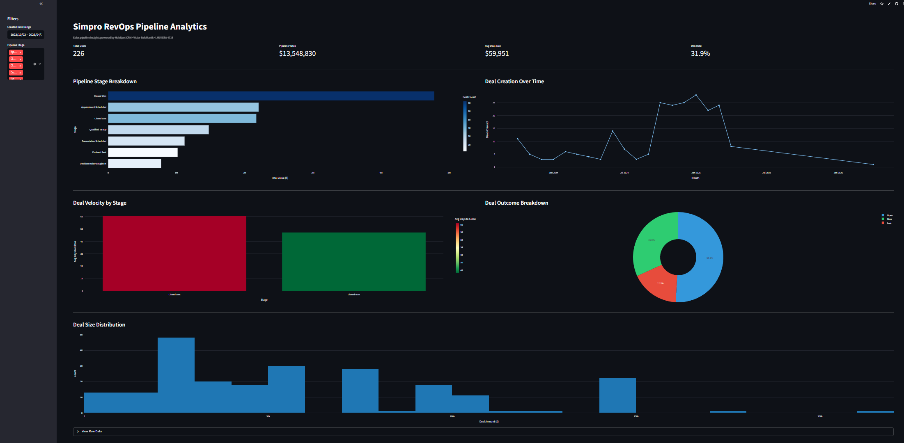

# Simpro RevOps Pipeline Analytics

This project builds an end-to-end analytics engineering pipeline targeting the Revenue Operations Analyst role at Simpro Group, a SaaS field service management company serving 22,000+ businesses worldwide. It extracts CRM deal and contact data from HubSpot via API and scrapes competitive intelligence from Simpro's website and review platforms using Firecrawl, then transforms both sources through a dbt star schema in Snowflake and surfaces pipeline health, deal velocity, and conversion insights in a deployed Streamlit dashboard. The result is a self-service analytics layer that answers the four core questions a RevOps analyst at Simpro would face daily: where deals stall, which lead sources convert best, how velocity trends over time, and what drives close probability.

## Job Posting

- **Role:** Revenue Operations Analyst
- **Company:** Simpro Group
- **Link:** [Job Posting (PDF)](docs/job-posting.pdf)

This project demonstrates the exact skills the role requires: building and maintaining operational dashboards in Streamlit, owning data reliability through dbt tests and GitHub Actions automation, partnering with data engineering via a structured ELT pipeline, and communicating revenue trends to stakeholders through descriptive and diagnostic analytics.

## Tech Stack

| Layer | Tool |
|---|---|
| Source 1 | HubSpot CRM API (deals, contacts, pipeline stages) |
| Source 2 | Firecrawl web scrape (Simpro site, G2, Capterra, competitors) |
| Data Warehouse | Snowflake |
| Transformation | dbt |
| Orchestration | GitHub Actions |
| Dashboard | Streamlit |
| Knowledge Base | Claude Code (scrape → summarize → query) |

## Pipeline Diagram

## ERD (Star Schema)

## Dashboard Preview

## Key Insights

**Descriptive (what happened?):** Pipeline is concentrated in early stages — the majority of open deals sit in Appointment Scheduled and Proposal stages, while Closed Won represents a small fraction of total deal volume, indicating significant drop-off through the funnel.

**Diagnostic (why did it happen?):** Deal velocity analysis shows the Proposal stage has the longest average cycle time, suggesting a follow-up breakdown after proposals are sent. Deals that close tend to do so within 30 days; deals that linger past 60 days rarely convert.

**Recommendation:** Implement a structured 5-day follow-up sequence for all deals in Proposal stage → Expected to reduce average cycle time and improve conversion rate for deals in the 30–60 day range.

## Live Dashboard

**URL:** <!-- Replace with your Streamlit public URL after deployment -->

## Knowledge Base

A Claude Code-curated wiki built from 20 scraped sources. Wiki pages live in `knowledge/wiki/`, raw sources in `knowledge/raw/`. Browse [`knowledge/wiki/index.md`](knowledge/wiki/index.md) to see all pages.

**Query it:** Open Claude Code in this repo and ask questions like:

- "What are the main pain points Simpro customers report on G2?"
- "Who are Simpro's main competitors and how do they differ?"
- "What RevOps metrics matter most to SaaS field service companies?"

Claude Code reads the wiki pages first and falls back to raw sources when needed. See `CLAUDE.md` for the query conventions.

## Setup & Reproduction

**Prerequisites:** Python 3.11+, Snowflake account, HubSpot free CRM account with Private App access token, Firecrawl API key.

Copy `.env.example` to `.env` and fill in your credentials:

    HUBSPOT_ACCESS_TOKEN=
    SNOWFLAKE_ACCOUNT=
    SNOWFLAKE_USER=
    SNOWFLAKE_PASSWORD=
    SNOWFLAKE_DATABASE=
    SNOWFLAKE_WAREHOUSE=
    SNOWFLAKE_ROLE=
    FIRECRAWL_API_KEY=

**Run the full pipeline:**

    pip install -r requirements.txt
    python pipeline/hubspot_extract.py
    cd dbt && dbt run && dbt test && cd ..
    streamlit run streamlit/app.py
    python pipeline/firecrawl_scrape.py

## Repository Structure

    .
    ├── .github/workflows/    # GitHub Actions pipelines (HubSpot daily, Firecrawl weekly)
    ├── pipeline/             # Extraction scripts (hubspot_extract.py, firecrawl_scrape.py)
    ├── dbt/                  # dbt project (staging + mart models, tests, macros)
    ├── streamlit/            # Streamlit dashboard (app.py)
    ├── knowledge/            # Knowledge base
    │   ├── raw/              # 20 scraped source documents
    │   └── wiki/             # Claude Code-generated wiki pages
    ├── docs/                 # Proposal, job posting, slides
    ├── .env.example          # Required environment variables
    ├── .gitignore
    ├── CLAUDE.md             # Project context for Claude Code
    └── README.md             # This file
