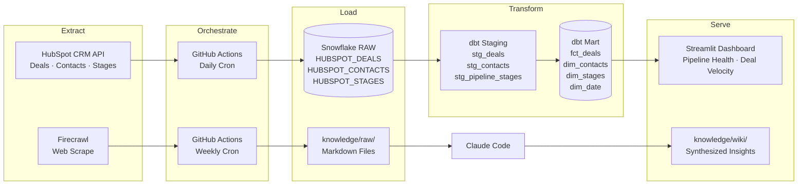

# Simpro RevOps Pipeline Analytics

An end-to-end analytics engineering portfolio project targeting the **Revenue Operations Analyst** role at Simpro Group. Demonstrates API extraction, cloud data warehousing, dimensional modeling with dbt, and automated orchestration via GitHub Actions.

**Student:** Victor Sofelkanik | **Course:** ISBA 4715 — Analytics Engineering, LMU

---

## Tech Stack

| Layer | Tool |
|---|---|
| Extraction | Python · HubSpot CRM API |
| Warehouse | Snowflake |
| Transformation | dbt (staging + mart) |
| Orchestration | GitHub Actions |
| Dashboard | Streamlit *(Milestone 2)* |
| Knowledge Base | Firecrawl · Claude Code *(Milestone 2)* |

---

## Pipeline Architecture



---

## Setup

### Prerequisites
- Python 3.11+
- Snowflake account (AWS US East 1)
- HubSpot free CRM account with Private App access token

### Environment Variables

Copy `.env.example` to `.env` and fill in your credentials. Never commit `.env`.

### Run Locally

```bash
pip install -r requirements.txt
python pipeline/hubspot_extract.py
cd dbt && dbt run && dbt test
```

---

## Data Model

*Star schema in `SIMPRO_REVOPS.MART`*

**Fact table:** `fct_deals` — one row per deal, with amount, stage, win/loss flag, and days to close

**Dimensions:**
- `dim_contacts` — contact name, company, lifecycle stage
- `dim_stages` — pipeline stage name, win probability
- `dim_date` — date spine for time-series analysis (2020–2030)

---

## Business Questions Answered

1. Where are deals getting stuck in the pipeline?
2. Which pipeline stages have the lowest conversion rates?
3. How does deal velocity trend over time?
4. What is the average deal size by stage?
