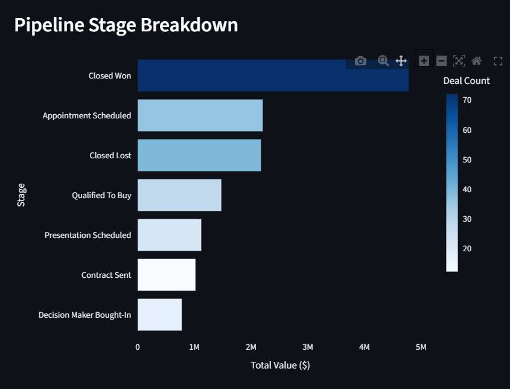
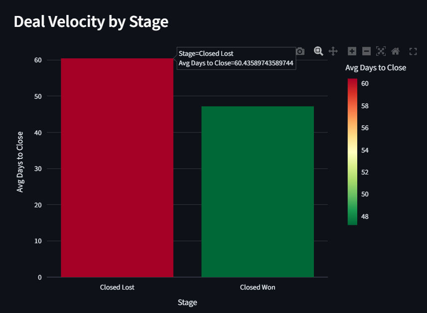

<!-- _class: lead invert -->

# Simpro RevOps Pipeline Analytics

Building the Analytics Layer a Revenue Operations Analyst Uses on Day One

**Victor Sofelkanik** · Loyola Marymount University · ISBA 4715 · May 2026

---

## What I Built

  
<strong>HubSpot API</strong> Deals · Contacts Stages

  
→

  
<strong>Snowflake</strong> RAW Layer 226 Deals

  
→

  
<strong>dbt</strong> Star Schema 4 Models

  
→

  
<strong>Streamlit</strong> Live Dashboard Deployed

  

226

Total Deals

  

$13.5M

Pipeline Value

  

$59,951

Avg Deal Size

  

31.9%

Win Rate

Automated daily via **GitHub Actions** · Modeled in **dbt** · Served in **Streamlit**

---

Descriptive Insight

"Closed Won Dominates Pipeline Value — 5 of 7 Open Stages Stall Below $1.5M"

  Closed Won: $5M+ &nbsp;|&nbsp; Next open stage: $2.3M 
  5 of 7 stages stuck below $1.5M 
  Opportunity: accelerate open deals, not generate new ones

---

## Diagnostic Insight

#### "Deals That Close Lost Take 27% Longer Than Wins — Velocity Is a Leading Indicator of Outcome"

  Closed Lost: 60.4 days &nbsp;|&nbsp; Closed Won: 47.4 days 
  Gap: 13 days — outcome is predictable

<ul style="font-size:0.7em; margin-top:6px; line-height:1.4;">
  <li>Lost deals linger and slow before the final outcome</li>
  <li>Won deals close decisively in under 50 days</li>
  <li>Every day past 50 days increases loss probability</li>
</ul>

---

## Recommendation

  Implement a structured 5-day follow-up sequence for all open deals exceeding 50 days in any stage
    
  → Expected to reduce average cycle time from 60 to under 50 days and shift stalling deals toward Closed Won within one quarter

<ul style="font-size:0.72em; margin-top:8px; line-height:1.4;">
  <li>Data shows a clear 50-day threshold separating wins from losses</li>
  <li>Timed intervention addresses drop-off before it becomes a closed loss</li>
  <li>Targets the exact velocity gap the diagnostic analysis identified</li>
</ul>

---

Skills Demonstrated

| JD Requirement | Project Evidence |
|---|---|
| SQL + cloud data warehouse | Snowflake + dbt staging and mart models |
| Dashboard and report building | Streamlit + Plotly, live and deployed |
| Data pipeline + modeling | GitHub Actions cron · dbt star schema · dbt tests |
| Non-technical communication | Takeaway titles, callouts, plain-language insights |

